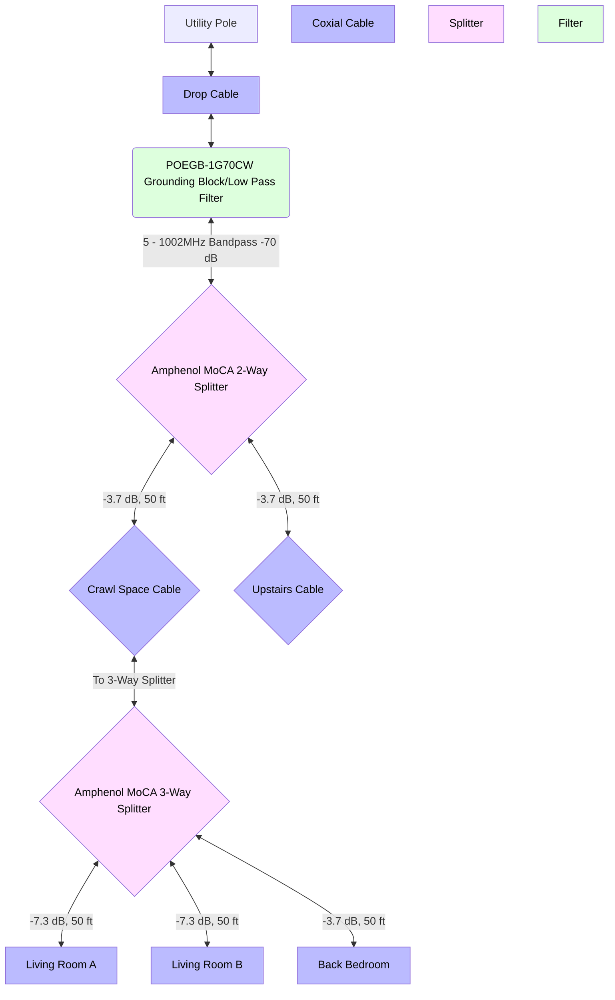
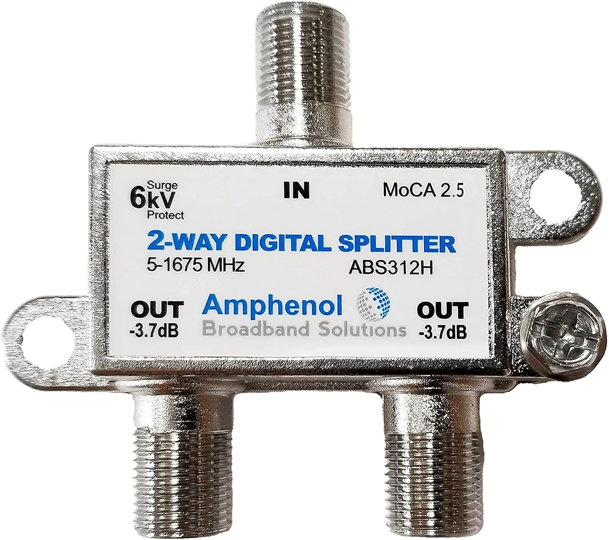
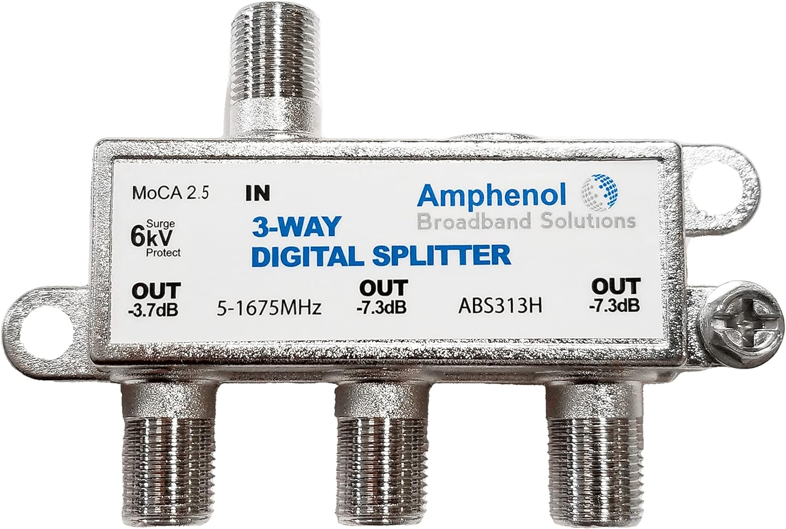

# Coaxial Cable Network

This documents how the coaxial cable network is setup. I changed some of the splitters so they could support [MoCA](#moca-overview).

## Network Block Diagram

## Components

### POEGB-1G70CW

### Amphenol MoCA 2-Way Splitter

### Amphenol MoCA 3-Way Splitter

## MoCA Overview

- **High-Speed Network**: MoCa is capable of delivering internet speeds comparable to traditional wired Ethernet connections, which is perfect for streaming high-definition video, online gaming, and other bandwidth-intensive activities.

- **Works Alongside TV Services**: MoCa technology doesn't interfere with your cable TV services. You can have both high-speed internet and cable TV running over the same coaxial cable.

- **Comparison to Ethernet**: It requires buying [these modems](https://www.amazon.com/goCoax-Ethernet-Bandwidth-existing-MA2500D/dp/B08XP8MMFG) and is slightly higher latency (3 ms turn around time), however it has one advantage. It functions as a broadcast network so each splitter acts like an ethernet switch and can pass traffic up or downstream.

This [site](https://mocalliance.org/index.php) should have more info.
